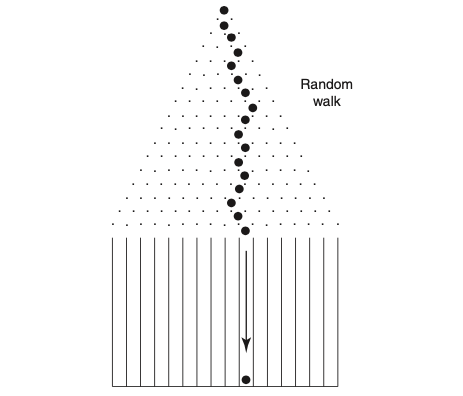

## Problem statement

Imagine a pinball maze like the one below. A ball is dropped into the maze $N$ times.
A few assumptions: (1) no ball ever leaves the container placed below the maze, and
(2) at each pin (each dot in the figure) the ball has only two options — left or right,
each equally likely.

The question: as we do this for a large number of throws,

$$ N \rightarrow \infty $$

what does the distribution of balls across the containers (i.e. the frequency of balls
in each slot) converge to?



## Simulation

Let's simulate the situation in Python.

```python
# function for simulating one throw
def oneThrow(numOfLayers):
    # generate left(-1) / right(+1) using a binomial distribution, equal probability
    bernoulliNumbers = np.random.binomial(1, 0.5, numOfLayers)
    decideNumbers = (lambda arr: [-1 if x == 0 else 1 for x in arr])(bernoulliNumbers)
    # final container slot
    finalContainerSlot = 0
    for decide in decideNumbers:
        finalContainerSlot += decide
    return decideNumbers, finalContainerSlot
```

```python
numberOfLayers = 100
numberOfThrows = 10000

finalContainerSlotArr = [oneThrow(numberOfLayers)[1] for i in range(numberOfThrows)]
```

Each throw is a sum of `numberOfLayers` independent $\pm 1$ steps — by the central
limit theorem, as `numberOfLayers` grows, the distribution of `finalContainerSlot`
across many throws converges to a normal distribution. The pinball maze is, in effect,
a physical Galton board.
