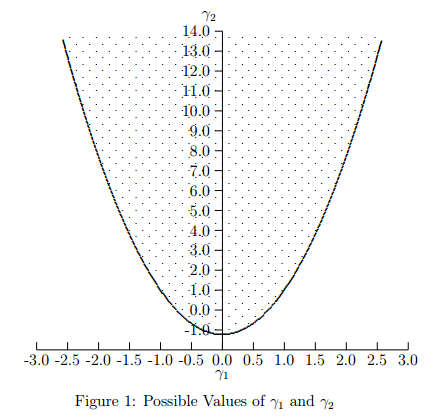
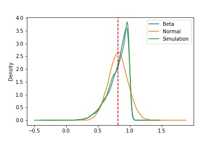
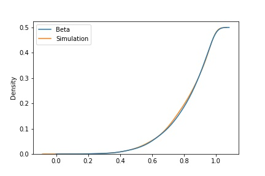

In the previous article, [Two-Moment Simulation](../2021-two-moment-simulation/index.qmd),
we discussed how to simulate normally-distributed points for a given mean and standard
deviation / covariance matrix.

Here, we discuss how to generate non-normal numbers with a unimodal distribution — i.e.
simulate using all four moments (mean, standard deviation, skewness, and kurtosis),
ignoring coskewness and cokurtosis.

We refer to the paper by Hao Luo [^1], which uses Fleishman's power method [^2] to
simulate non-normal data.

The idea is to first simulate a series $Y$ using the power method:

$$ Y \sim D(0,1, \gamma_{1}, \gamma_{2}) $$

where $\gamma_1$, $\gamma_2$ are the skewness and excess kurtosis of the distribution
$D$, respectively.

Second, we use our understanding from the previous article to convert the first two
moments of $D$ from $[0,1]$ to $[\mu, \sigma / \Sigma]$.

## Algorithm

As per the power method, $Y$ can be defined as a third-degree polynomial of $X$:

$$ Y = a + bX + cX^{2} + dX^{3} $$

where $X \sim N(0,1)$.

We solve for:

$$ E(Y) = 0,\quad E(Y^{2}) = 1,\quad E(Y^{3}) = \gamma_{1},\quad E(Y^{4}) = \gamma_{2} + 3 $$

The following four equations follow from solving the above:

$$ F_1(b,c,d) : b^2+6bd+ 2c^2 +15d^2-1 =0 $$

$$ F_2(b,c,d) : 2c(b^2+24bd+105d^2+2)-\gamma_1=0$$

$$ F_3(b,c,d) : 24\big(bd + c^2[1 + b^2 + 28bd] + d^2[12 + 48bd + 141c^2 + 225d^2]\big)-\gamma_2 = 0 $$

$$ a = -c $$

To solve for $a, b, c, d$:

$$ \min_{b,c,d} F(b,c,d) = F_1^2(b,c,d)+F_2^2(b,c,d)+F_3^2(b,c,d) $$

constrained on

$$ F_i(b,c,d) =0 \quad \forall\ i \in (1,3) $$

A solution to the above exists only when

$$ \gamma_2 = -1.2264489 + 1.6410373\, \gamma_1^2 $$

{fig-align="center"}

Finally, apply the transformation:

$$ Y[\mu, \Sigma, \gamma_1, \gamma_2] = \mu + \sqrt{\Sigma} \times Y[0, 1, \gamma_1, \gamma_2] $$

## Results

Let's simulate a beta distribution with $\alpha = 4.5$ and $\beta = 1$. The left chart
shows the PDF of the beta distribution, the simulated beta using the methodology above,
and a normal distribution with mean $\mu(\text{Beta}(4.5,1))$ and standard deviation
$\sigma(\text{Beta}(4.5,1))$. The right chart shows the cumulative distribution of the
same, excluding the normal.

::: {layout-ncol=2}

:::

> The PDF and its cumulative distribution are very close to each other by the
> Kolmogorov–Smirnov statistic.

First four moment values for all three cases:

| Stat | Beta | Normal | Simulation |
|:----:|:----:|:------:|:----------:|
| Mean | 0.82 | 0.82   | 0.81       |
| Std  | 0.15 | 0.15   | 0.15       |
| Skew | -1.13| 0      | -1.08      |
| Kurt | 1.02 | 0      | 0.88       |

[^1]: Hao Luo (2011). *Generation of Non-normal Data – A Study of Fleishman's Power
    Method.* [diva-portal.org](https://www.diva-portal.org/smash/get/diva2:407995/FULLTEXT01.pdf)

[^2]: Fleishman, A. I. (1978). *A method for simulating non-normal distributions.*
    Psychometrika. [springer.com](https://link.springer.com/article/10.1007/BF02293811)
