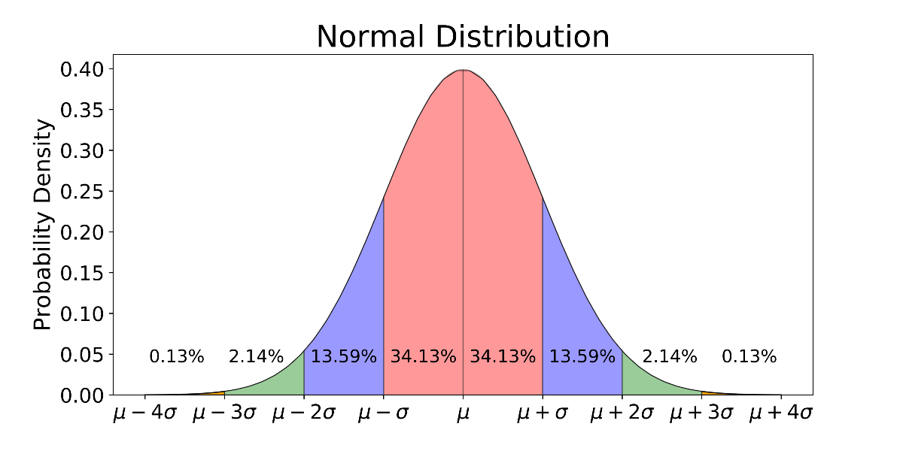
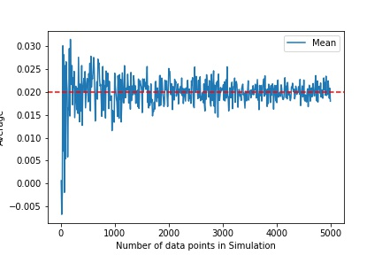
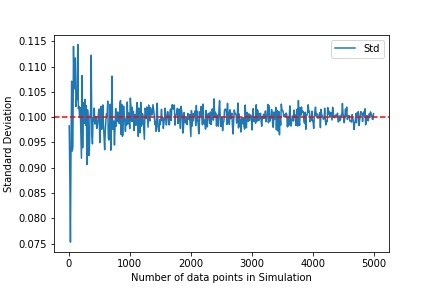

This article looks at how to simulate a series with a normal distribution — i.e. where
the higher moments (skew, excess kurtosis) are zero. For simulation with four moments,
see [Four-Moment Simulation](../2021-four-moment-simulation/index.qmd).

In the first part we look at the univariate case (1 dimension); in the second, we see
how to incorporate covariance for more than one dimension.

## Univariate simulation (1 dimension)

The idea is to simulate a series

$$ X \sim N(\mu , \sigma) $$

given $\mu$ and $\sigma$.



> The probability distribution for a random variable that is normally distributed:
> every point $x_i = \mu + z \times \sigma$, where $z \in (-\infty, \infty)$.

$$ X \sim N(\mu , \sigma) \mid z \sim N(0,1) $$

$$ X = \mu + N(0,1) \times \sigma $$

To generate $N(0,1)$ we can use the Box–Muller transformation. In Excel:

```
NORM.S.INV(rand())
```

where `rand()` draws from a uniform distribution on (0,1), and `NORM.S.INV` is the
inverse of the cumulative normal distribution.

::: {layout-ncol=2}



:::

> The number of simulated data points is critical to the accuracy of the simulation —
> more data points lead to higher accuracy.

Higher accuracy for the expected mean and variance with fewer data points can be
achieved using random matrix theory — a topic for a future post.

## Multivariate simulation (>1 dimension)

The idea is to simulate a series

$$ X \sim N(M , \Sigma) $$

given $M$ (an array of means) and $\Sigma$ (a covariance matrix).

$$ X = M + N(0,1) \times \sqrt{\Sigma} $$

where $\sqrt{\Sigma} = L$ is the Cholesky decomposition of $\Sigma = LL^T$.
